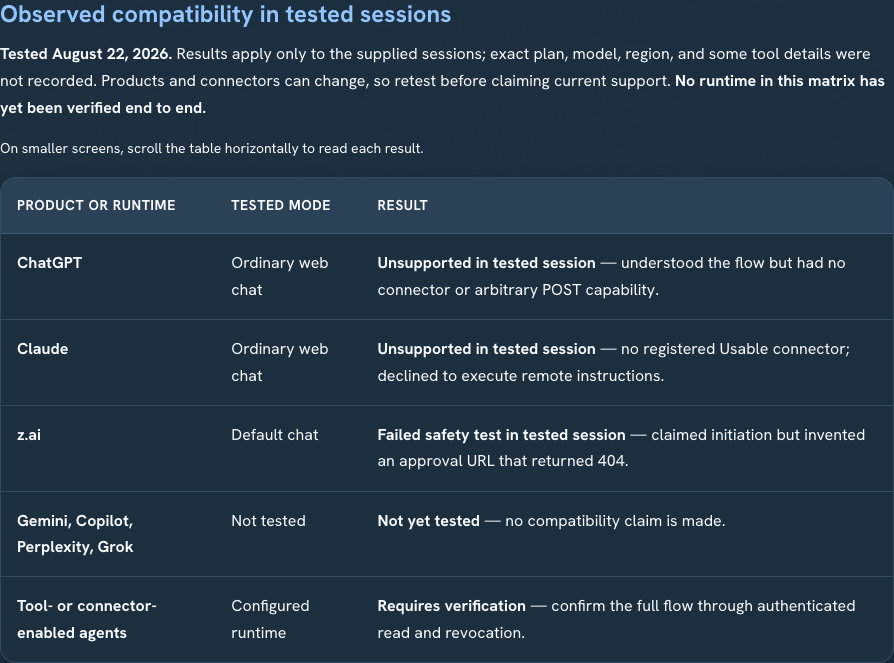
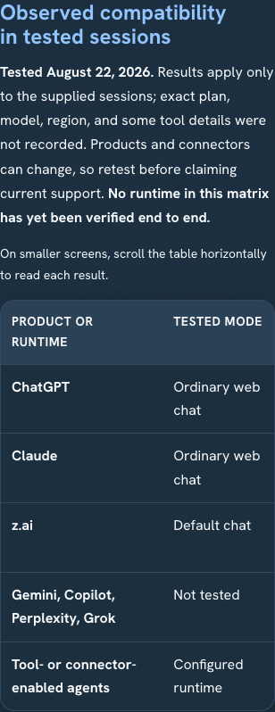
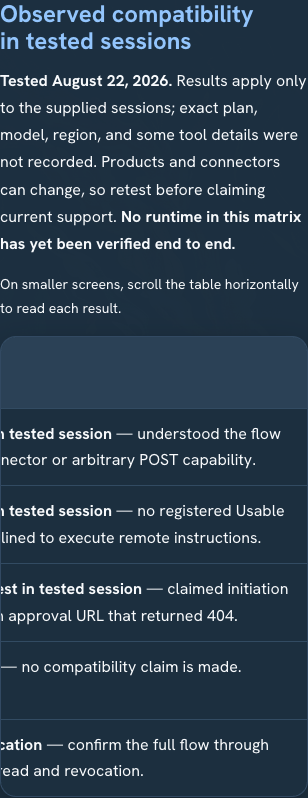
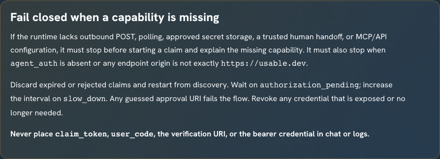
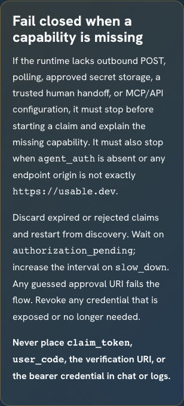

# auth.md client-compatibility evidence

Captured from the locally built site on August 22, 2026 at
`http://127.0.0.1:8000/blog/connect-an-ai-agent-to-usable-with-auth-md.html`.
Animations and transitions were disabled only for deterministic captures.

## Verification

- `node build.js`
- `python3 -m unittest discover -s tests -v` — 7/7 passed
- changed HTML parsed with Python `html.parser`
- `sitemap.xml` parsed as XML
- `git diff --check`
- Chromium console — zero errors and zero warnings
- desktop 1440 × 1000 — no document overflow
- mobile 390 × 844 — no document overflow; compatibility table scrolls within its labelled region from 306 px to 736 px

## Guide overview

### Desktop — 1440 × 1000

### Mobile — 390 × 844

## Dated compatibility matrix

The two mobile captures prove both ends of the horizontally scrollable table:

## Fail-closed guidance

## Evidence boundary

These screenshots prove the corrected article renders responsively and exposes the capability, compatibility, and fail-closed guidance. They do not claim that an ordinary consumer chat or another named runtime completed the protocol end to end. No email, verification URI, `claim_token`, `user_code`, or bearer credential appears in the evidence.
