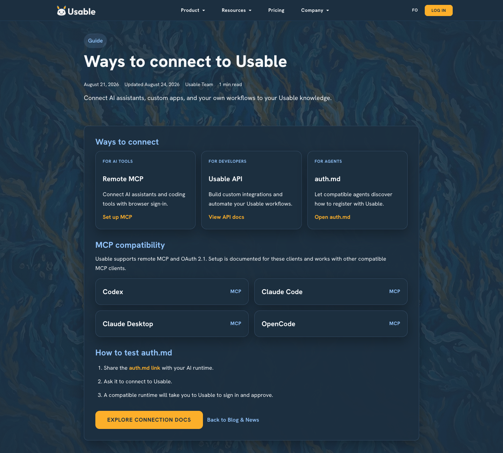
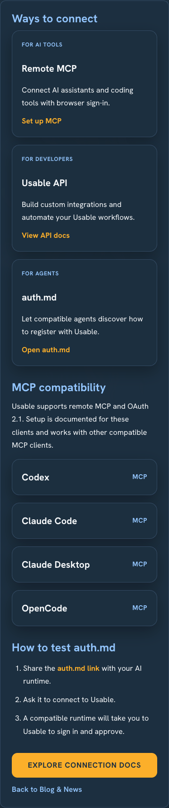

# auth.md compatibility evidence

Captured from the locally built site on August 24, 2026 at
`http://127.0.0.1:8001/blog/connect-an-ai-agent-to-usable-with-auth-md.html`.
Animations and transitions were disabled only for deterministic captures.

## Verification

- `node build.js`
- `python3 -m unittest discover -s tests -v` — 8/8 passed
- changed HTML parsed with Python `html.parser`
- `sitemap.xml` parsed as XML
- `git diff --check`
- Chromium console — zero errors and zero warnings
- desktop 1440 × 1300 — no document overflow
- mobile 390 × 844 viewport — no document overflow; article body captured at 358 × 1702

## Public connection page

### Desktop — 1440 × 1300

### Mobile article — 358 × 1702

## Evidence boundary

These screenshots prove the customer page presents remote MCP, API, and auth.md as distinct connection paths; names documented MCP clients as examples; and shows how to test auth.md. No protocol internals or secret values appear.
